### 物料篇
------

#### 现代Camera 硬件原理
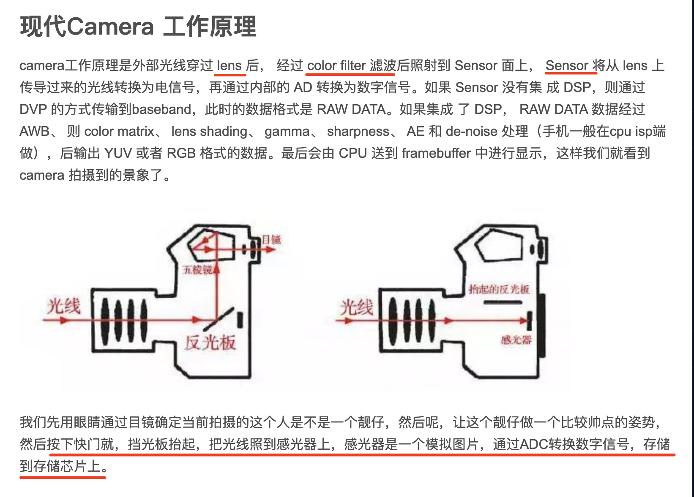

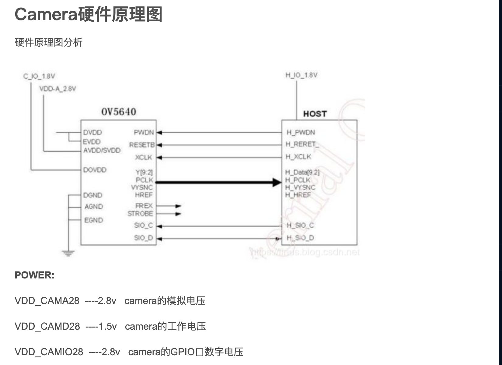

--------
#### CCD 与 CMOS

------

##### 单目相机成像原理
* 成像基于小孔成像模型，关于小孔成像模型
* 在成像方式上，比较常见的有CCD（电荷耦合器件，Charge Coupled Device)和CMOS（Complementary Metal-Oxide-Semiconductor，互补金属氧化物半导体)两种方式
* 在接受光照之后，感光元件产生对应的电流，电流大小与光强对应，因此感光元件直接输出的电信号是模拟的。在CCD传感器中，每一个感光元件都不对此作进一步的处理，而是将它直接输出到下一个感光元件的存储单元，结合该元件生成的模拟信号后再输出给第三个感光元件，依次类推，直到结合最后一个感光元件的信号才能形成统一的输出。
* 由于感光元件生成的电信号实在太微弱了，无法直接进行模数转换工作，因此这些输出数据必须做统一的放大处理。这项任务是由`CCD传感器中的放大器`专门负责，经放大器处理之后，每个像点的电信号强度都获得同样幅度的增大。但由于CCD本身无法将模拟信号直接转换为数字信号，因此还需要一个专门的`模数转换芯片`进行处理，最终以二进制数字图像矩阵的形式输出给专门的`中央控制器处理芯片`。
* 相比而言CMOS传感器中每一个感光元件都`直接整合了放大器和模数转换逻辑（ADC）`，当感光二极管接受光照、产生模拟的电信号之后，电信号首先被该感光元件中的放大器放大，然后直接转换成对应的数字信号。
* `CCD和CMOS的工作原理有一个共通点，那就是都是用光敏二极管来作为光-电信号的转化元件`。它们每个感光元件的像素点分别对应图像传感器中的一个像点，由于感光元件只能感应光的强度，无法捕获色彩信息，因此彩色CCD/CMOS图像传感器必须在感光元件上方覆盖`彩色滤光片`。在这方面，不同的传感器厂商有不同的解决方案，最常用的做法是覆盖RGB红绿蓝三色滤光片，以1：2：1的构成由四个像点构成一个彩色像素（即红蓝滤光片分别覆盖一个像点，剩下的两个像点都覆盖绿色滤光片），这种解决方案就是大名鼎鼎的`贝尔滤镜`。采用`贝尔插值`可以分别获得RGB三个分量的灰度信息。

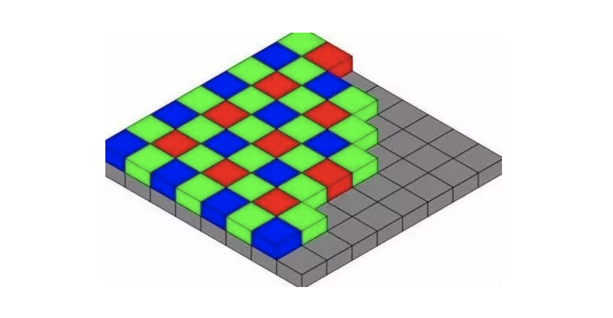
##### 双目相机 - 具体原理见后 -> 相机成像模型

##### 深度相机 - 见后 -> 相机成像模型     

---------

####  相机成像模型

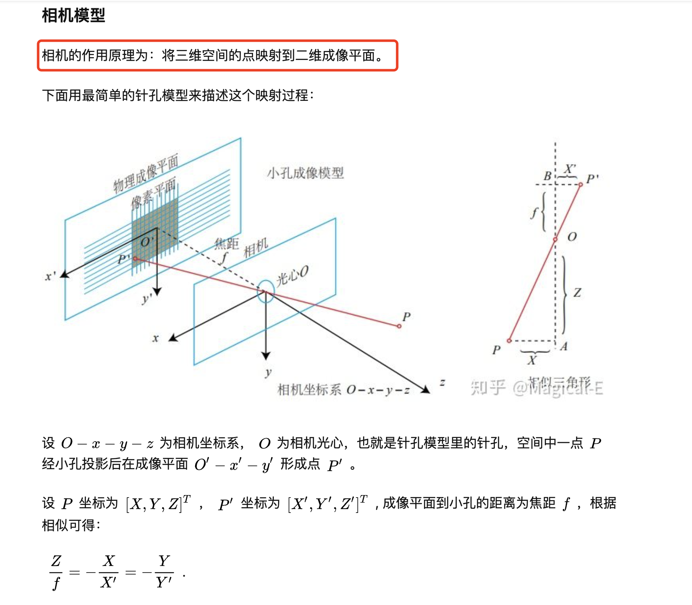
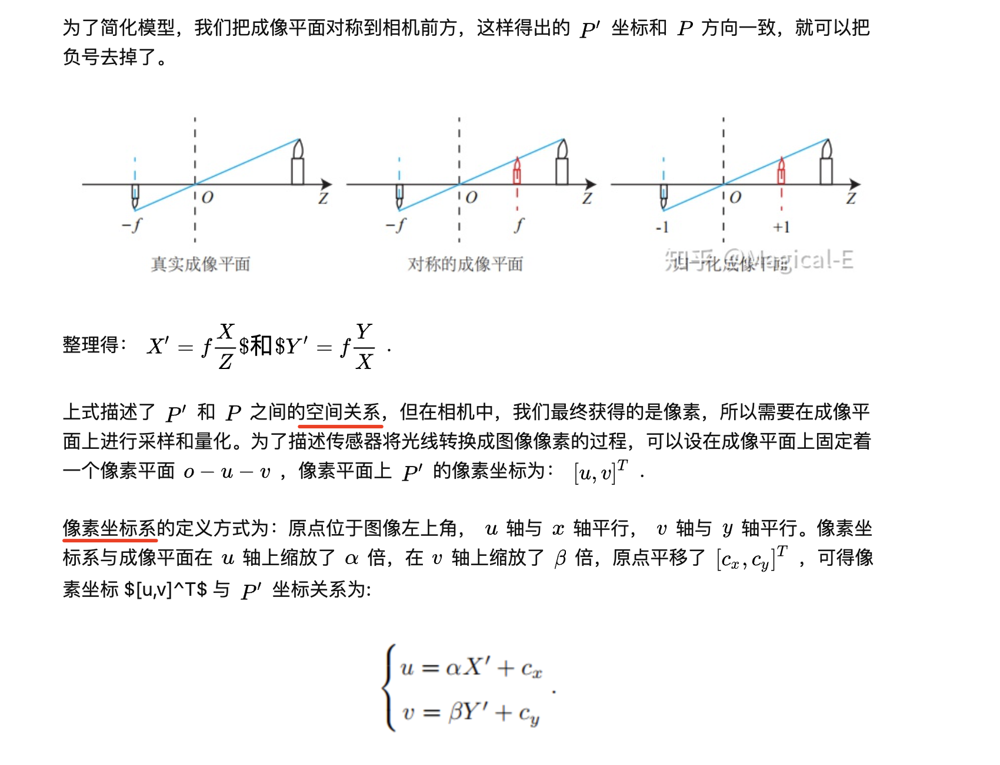

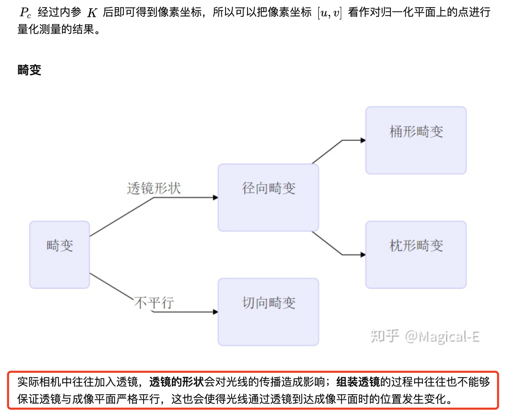
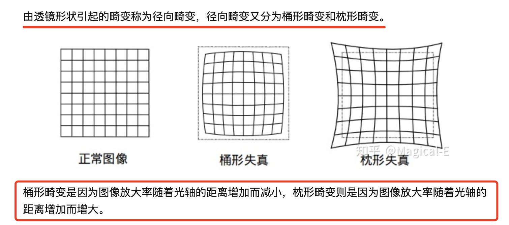
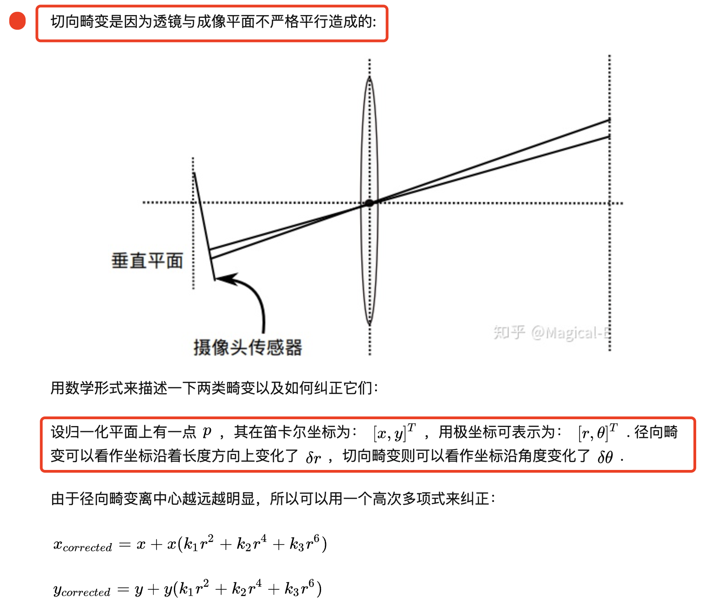

##### [畸变矫正公式 参考1](https://blog.csdn.net/weixin_44010117/article/details/107989223)
##### [畸变矫正公式 参考2](https://www.jianshu.com/p/6daa8dbbfa30)

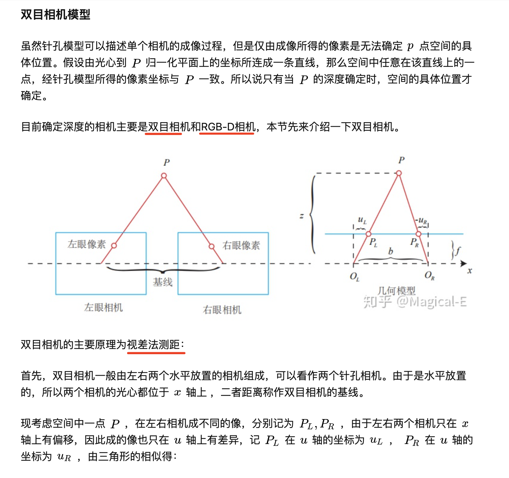
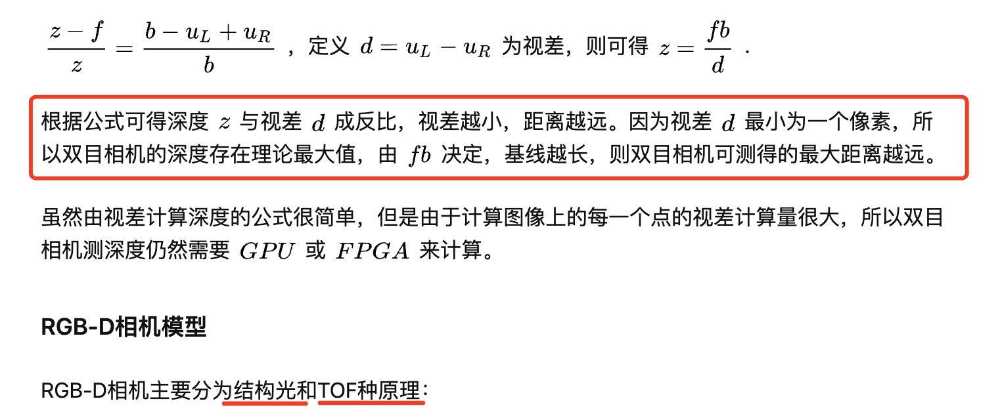

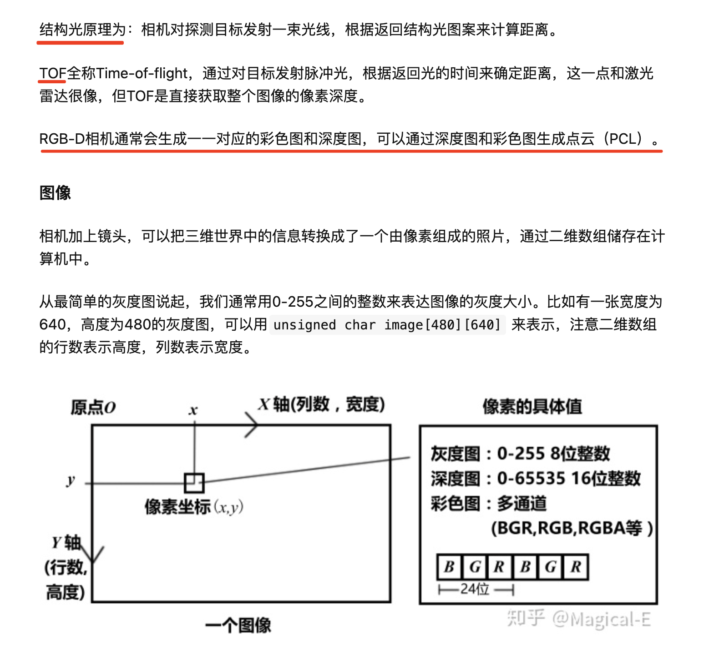
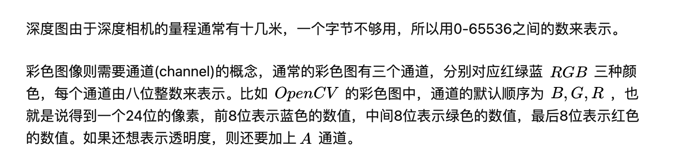

----------
##### 参考
[参考 1](http://zhaoxuhui.top/blog/2018/12/14/SLAMCamera.html)     
[参考 2](https://zhuanlan.zhihu.com/p/89084020)     
[参考 3](https://zhuanlan.zhihu.com/p/47994715)     
[参考 4](https://blog.csdn.net/weixin_44010117/article/details/107989223)     
[参考 5](https://www.jianshu.com/p/6daa8dbbfa30)     
[参考 6](http://zhaoxuhui.top/blog/2018/03/18/Location&PoseEstimationInSLAM.html#2%E5%B0%8F%E5%AD%94%E6%88%90%E5%83%8F%E6%A8%A1%E5%9E%8B)     
[重要参考](https://www.zhihu.com/question/51510464)     

----------

