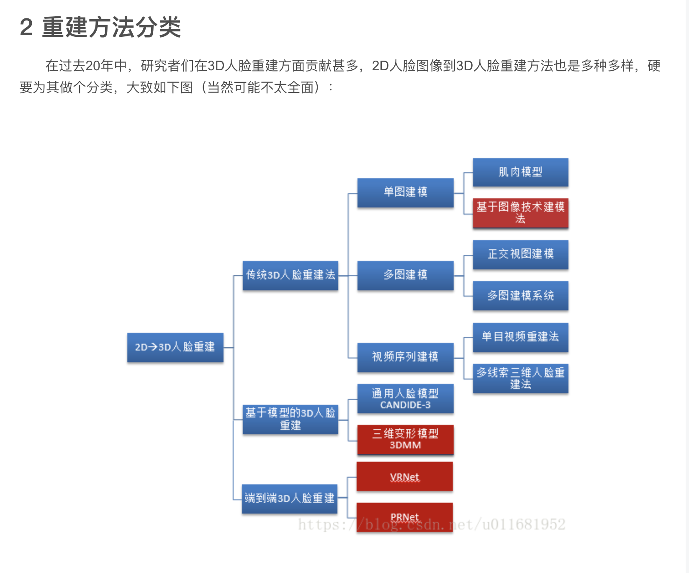
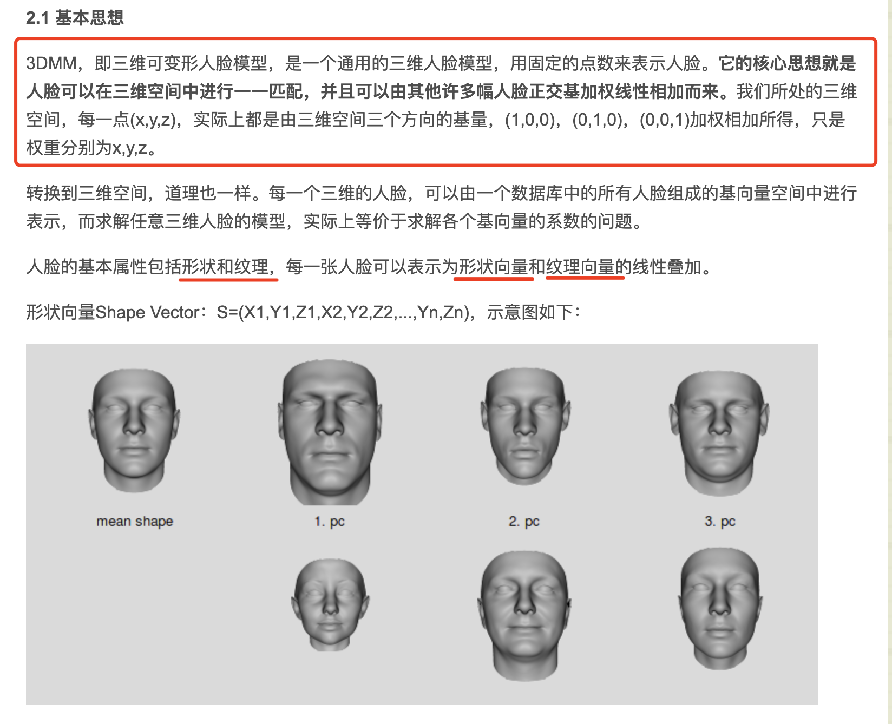
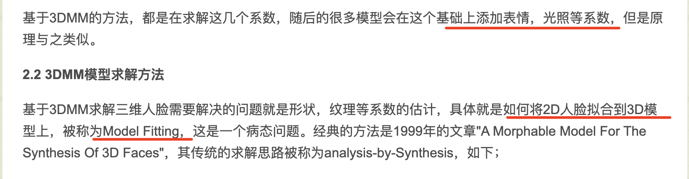
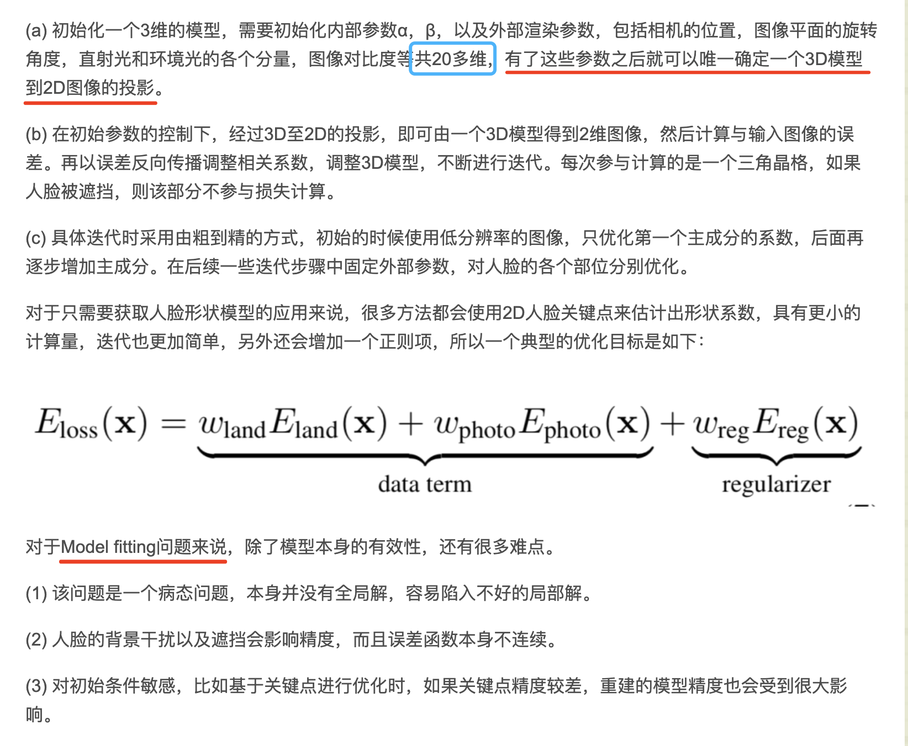
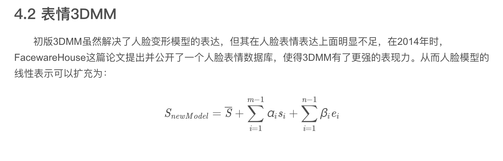
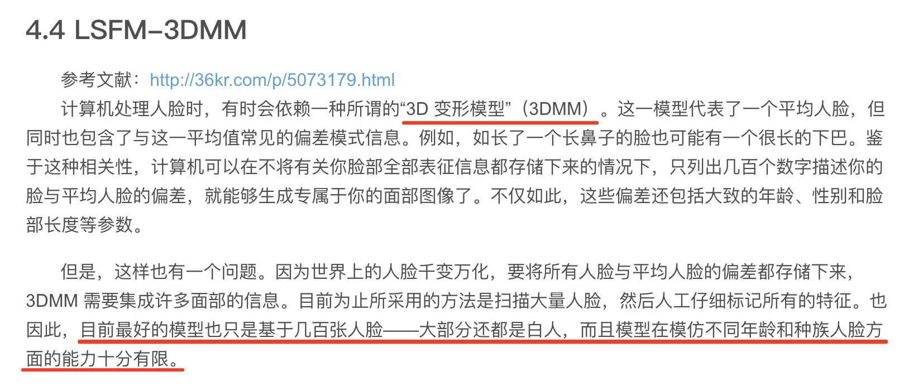

### 人脸重建
----
#### 什么是人脸重建

目前获取人脸三维模型的方法主要包括三种，软件建模，仪器采集与基于图像的建模。
* 软件建模 - 3DMax
* 三维成像仪器 - 基于结构光和激光仪器的三维成像仪是其中的典型代表。
    * 基于仪器采集的三维模型，精度可达毫米级，是物体的真实三维数据。
    * 用来为基于图像的建模方法提供评价数据库。不过仪器的成本太高。
* 基于图像的建模技术（image based modeling）
    * 是指通过若干幅二维图像，来恢复图像或场景的三维结构。

#### 3DMM 方法
[参考 1](https://blog.csdn.net/hacker_long/article/details/107479264)           
[参考 2](https://blog.csdn.net/u011681952/article/details/82623328)      

剩余部分模型描述，参见 [参考 2](https://blog.csdn.net/u011681952/article/details/82623328)      

#### 深度学习 3DMM重建
* 全监督方法
    * Regressing Robust and Discriminative 3D Morphable Models with a very Deep Neural Network
        * 3DMM CNN
            * 3DMM CNN是一个非常简单的回归模型，它使用了ResNet101网络直接回归出3DMM的形状系数和纹理系数，形状系数和纹理系数各有99维
            * 数据获取 - 用CASIA WebFace数据集中的多张照片进行model fitting求解生成了对应的三维人脸模型，将其作为真值(Ground Truth)，从而得到了二维三维图像对。
            * 优化目标的设计 - 用标准的欧拉损失函数来最小化距离，会使得到的人脸模型太泛化，趋于平均脸。对此作者们提出了一个非对称欧拉损失，使模型学习到更多的细节特征，使三维人脸模型具有更多的区别性。
            * 公式见 [参考 1](https://blog.csdn.net/hacker_long/article/details/107479264)       
* 自监督方法
    * 这一类方法不依赖于真实的成对数据集，它将二维图像重建到三维，再反投影回二维图
    * MoFa
        * 输入首先经过一个Deep Encoder提取到语义相关的系数，系数包含了人脸姿态，形状，表情，皮肤，场景光照等信息。
        * 然后将该系数输入基于模型的decoder，实现三维模型到二维图像的投影，模型可以使用3DMM模型。
        * 最后的损失是基于重建的图像和输入图像的像素损失。
        * 还可以添加关键点损失，系数正则化损失作为约束。
* 人脸的三维特征编码
    * 基于3DMM模型将三维人脸进行更好的特征编码
    * 3DDFA - Face Alignment Across Large Poses: A 3D Solution
        * 使用Projected Normalized Coordinate Code(简称PNCC)作为预测特征
        * 模型详细见 [参考 1](https://blog.csdn.net/hacker_long/article/details/107479264)       
        * 使用3DDFA拟合之后，抽取HOG特征作为输入，使用线性回归来进一步提升2D特征点的定位精度。
    * PRNet - Joint 3D Face Reconstruction and Dense Alignment with Position Map Regression Network
        * 利用UV位置图(UV position map)来描述3D形状。
        * 用CNN网络直接预测UV位置图，如此，采用一个编解码结构即可。
        * 作者们为了更好的预测坐标，或者说为了使预测出来的结果更有意义，计算损失函数时对不同区域的顶点误差进行加权。不同区域包括特征点，鼻子眼睛嘴巴区域，人脸其他部分，脖子共四个区域。它们的权重比例为16:4:3:0，可见特征点最重要，脖子不参与计算。

#### 3DMM 展望

