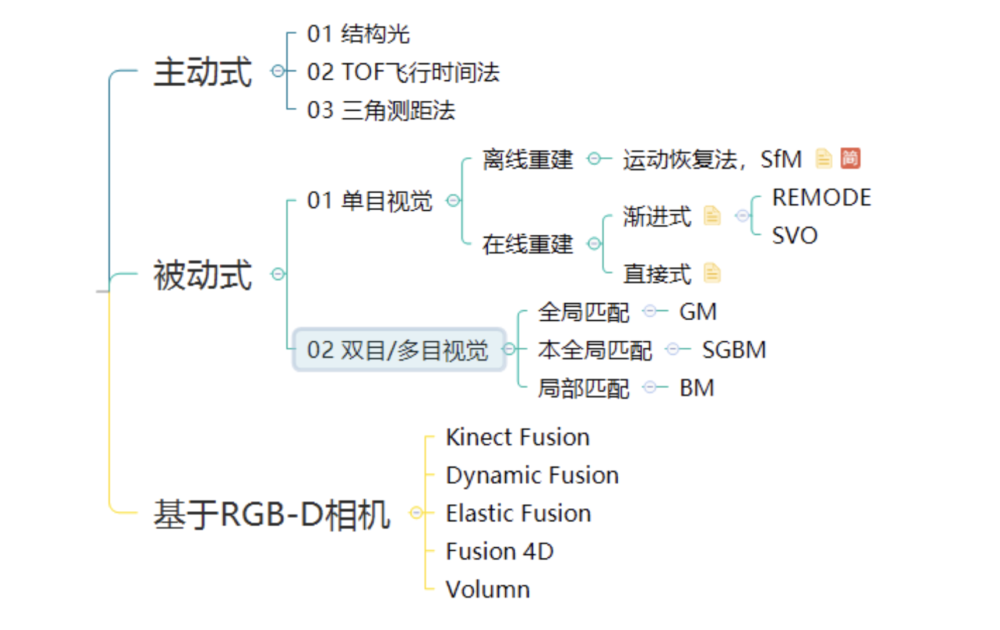
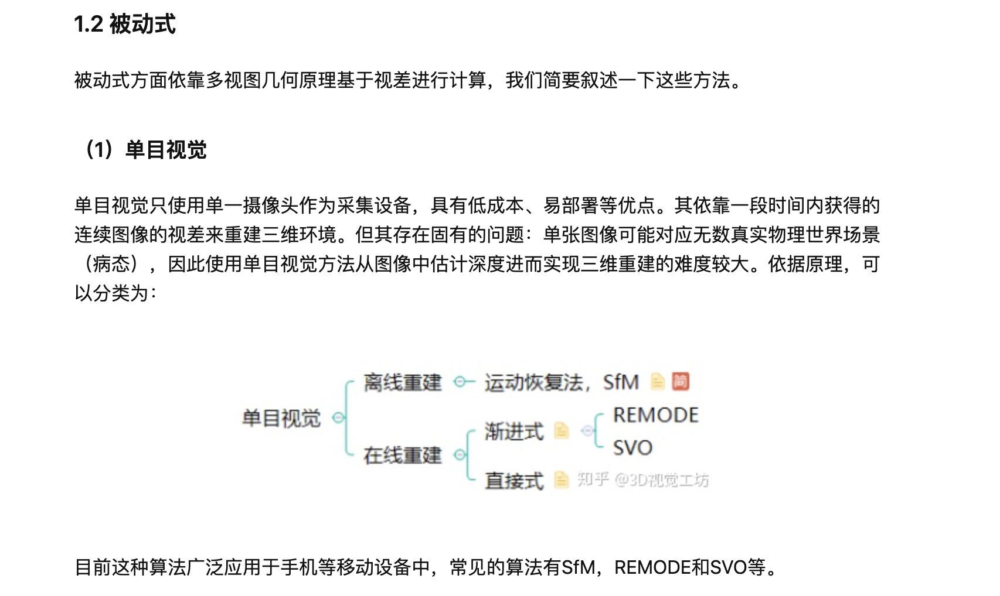
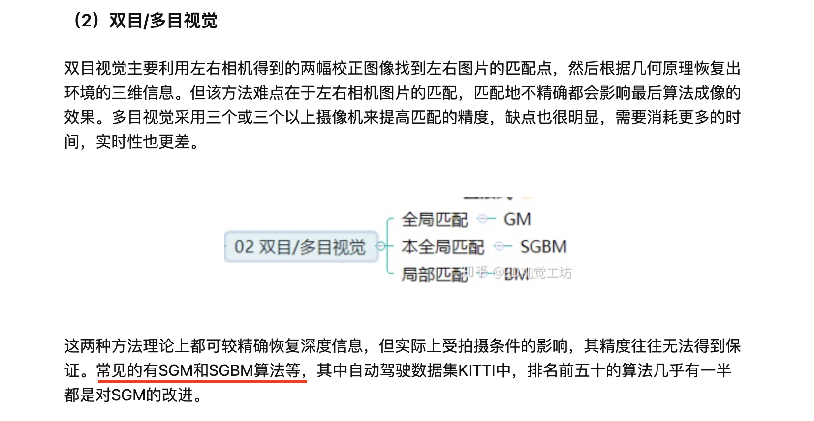
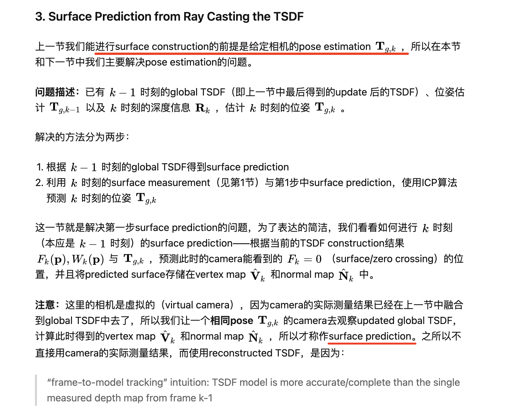
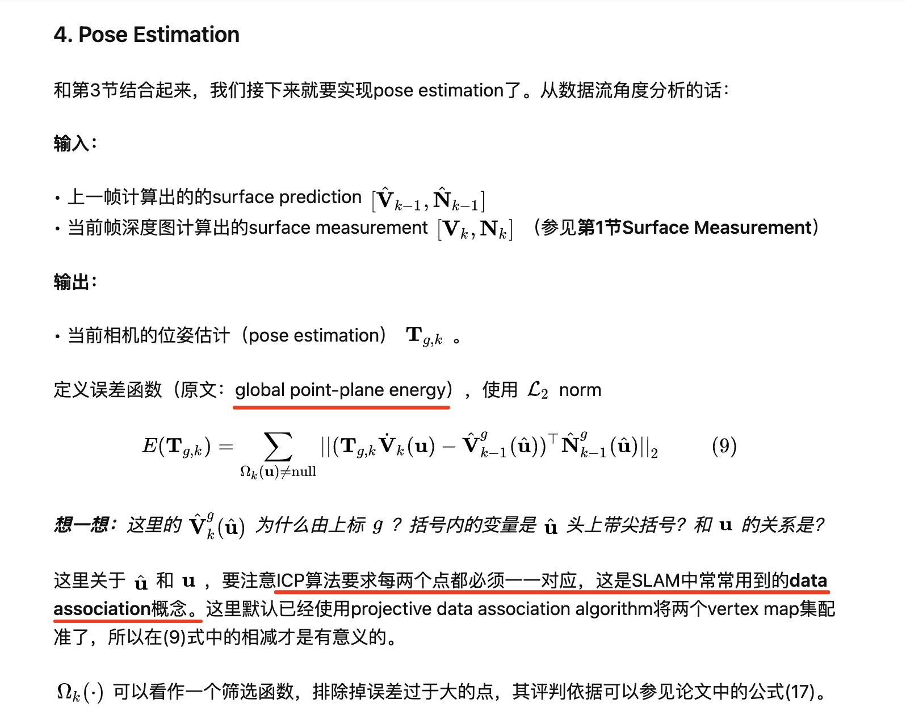
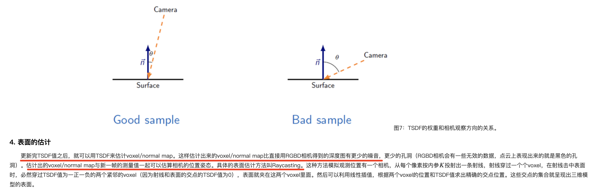
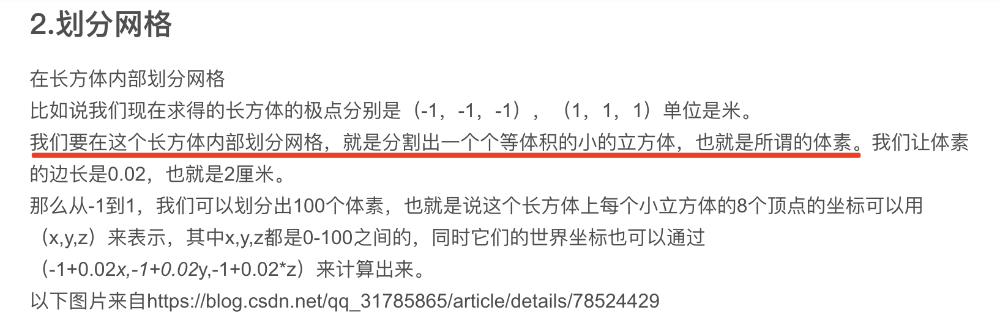
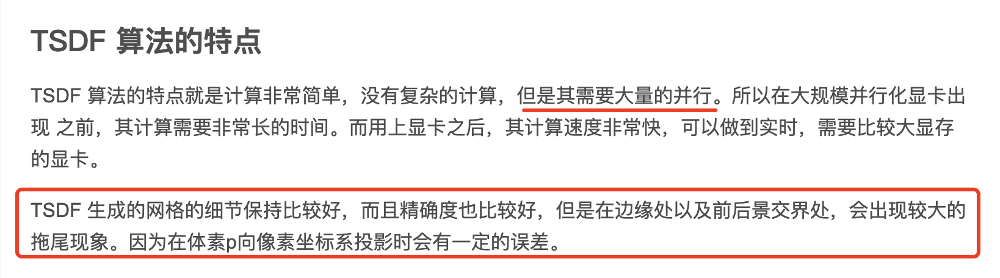
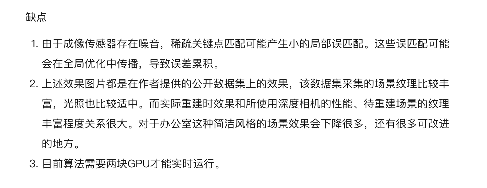

### 3D 重建 深度学习方法
-------
[参考](https://zhuanlan.zhihu.com/p/79628068)
------

--------
### 3D 重建 传统方法
--------

----------

### 论文阅读
-------
#### KinectFusion论文阅读

------------
#### 补充

[Github 的一个实现 - Kintinuous](https://github.com/mp3guy/Kintinuous)

----------

-------
#### Bundle Fusion 论文阅读
[官网](http://graphics.stanford.edu/projects/bundlefusion/)                            
[论文](https://arxiv.org/pdf/1604.01093.pdf)                                
[代码](https://github.com/niessner/BundleFusion)                         
[算法解读](https://mp.weixin.qq.com/s?__biz=MzIxOTczOTM4NA==&mid=2247485487&idx=1&sn=068e04d652578deb55e93b1a32fa9a21&chksm=97d7edb8a0a064ae265e9beb0f337f36fd3470a14ce97701cb16710608e0f1899c3d03b196ff&scene=21#wechat_redirect)                         

https://blog.csdn.net/fuxingyin/article/details/52921958     

https://blog.csdn.net/cc13949459188/article/details/103614402        

http://www.cxyzjd.com/article/qq_41318333/109672102           
http://www.cxyzjd.com/article/weixin_38636815/107295092          
http://www.cxyzjd.com/article/weixin_38636815/107838359           
http://www.cxyzjd.com/article/weixin_38636815/107694846         
http://www.cxyzjd.com/article/u014660846/108438052           
http://www.cxyzjd.com/article/fuxingyin/52921958           
     

https://zhuanlan.zhihu.com/p/86718461          

-------
#### InfiniTAM 论文阅读
InfiniTAM提供Linux，iOS，Android平台版本，CPU可以实时重建。        
[官网](https://www.robots.ox.ac.uk/~victor/infinitam/)
[GitHub代码](https://github.com/victorprad/InfiniTAM)

-------
#### ElasticReconstruction 论文阅读
[项目官网](http://qianyi.info/scene.html)
[GitHub代码]()

