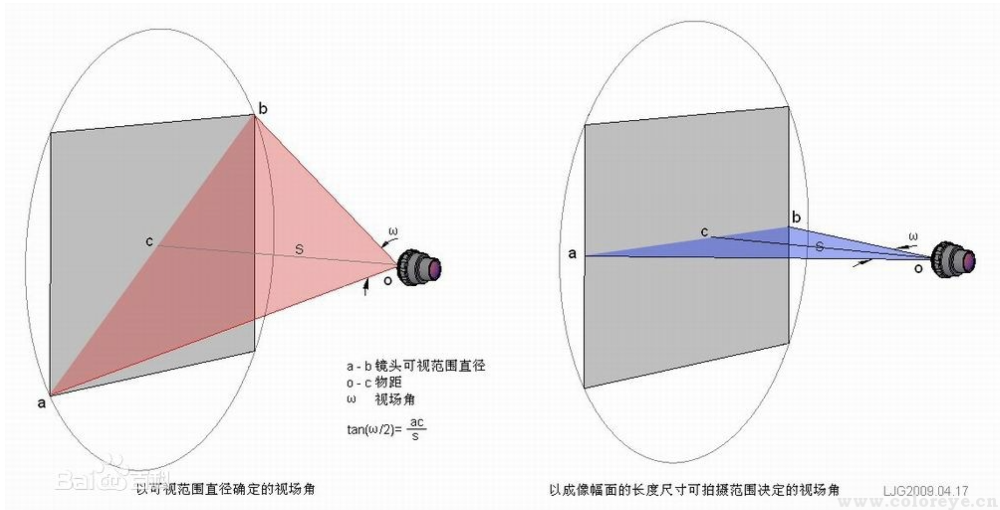
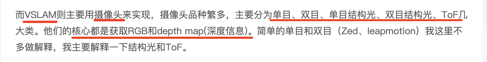
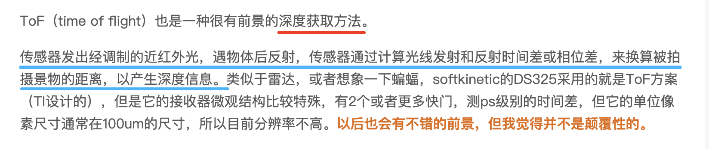
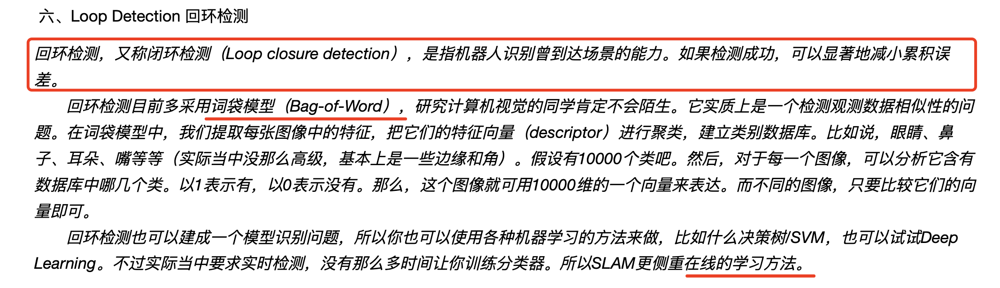
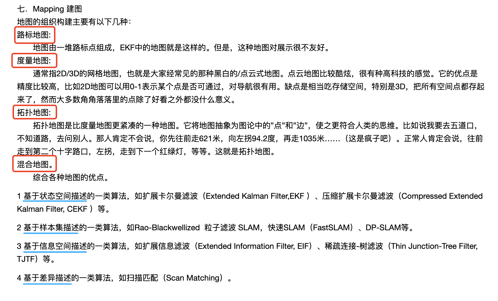
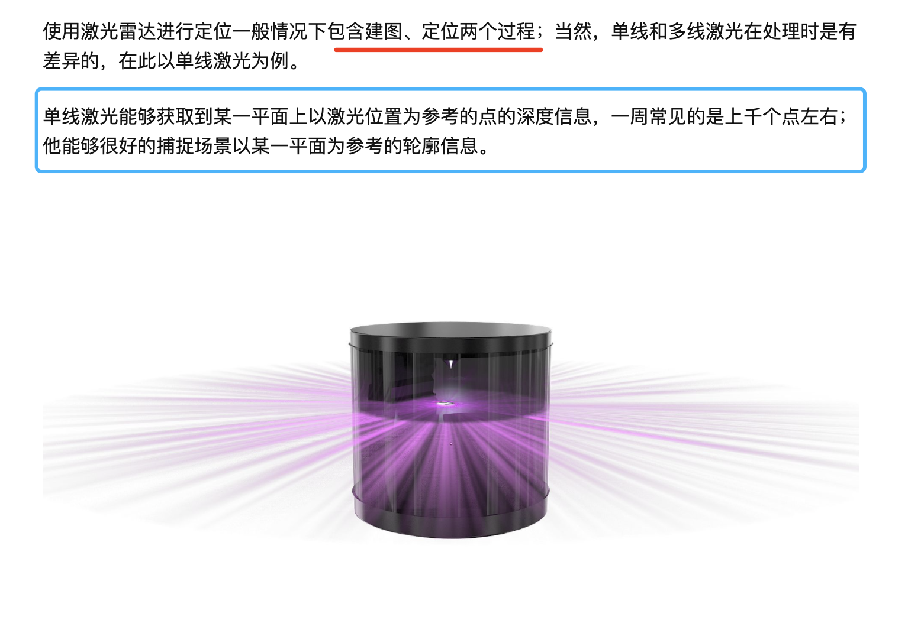
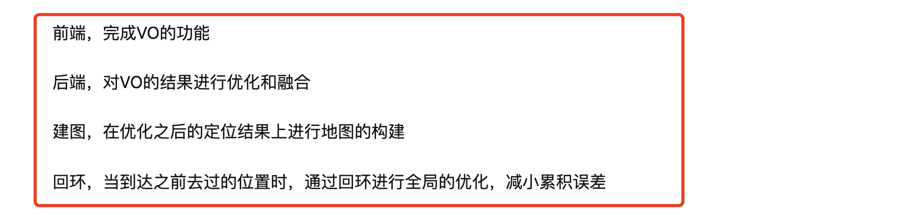
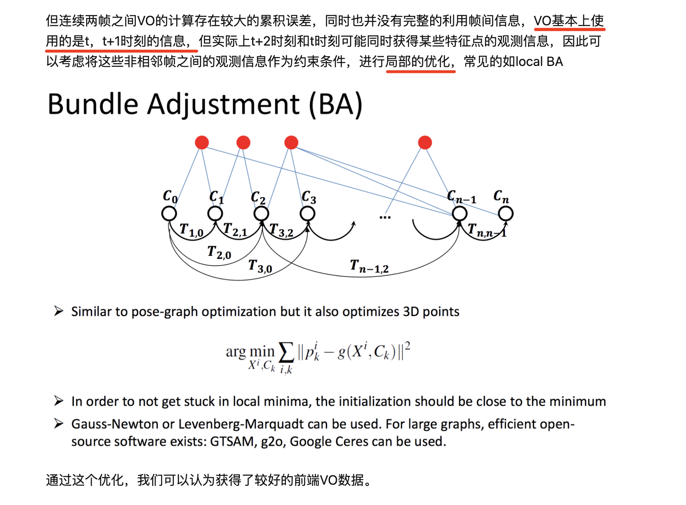

### SLAM - simultaneous localization and mapping 同时定位与建图
----

#### 名词解释
* FOV - 视场角
    *  在光学仪器中，以光学仪器的镜头为顶点，以被测目标的物像可通过镜头的最大范围的两条边缘构成的夹角，称为视场角。如图一。 视场角的大小决定了光学仪器的视野范围，视场角越大，视野就越大，光学倍率就越小。通俗地说，目标物体超过这个角就不会被收在镜头里。
    *  在显示系统中，视场角就是显示器边缘与观察点（眼睛）连线的夹角。 例如在图二中，AOB角就是水平视场角，BOC就是垂直视场角。
    

------

#### SLAM 大体框架
`SLAM 是卷积神经网络和深度学习的补充：SLAM 关注于几何问题而深度学习是感知、识别问题的大师。`     

SLAM是simultaneous localization and mapping的简写，中文直译为同时定位与建图，其中又以定位更为核心，建图实际上是在定位的基础上，将观测数据进行融合的过程。    

SLAM涵盖的东西比较多，分为前端和后端两大块。
* `前端`主要是研究相邻帧的拼接，又叫配准。根据`传感器`不一样，有`激光点云、图像、RGB-D拼接`几种，其中`图像配准`中又分`基于稀疏特征(Sparse)的和稠密(Dense)`的两种。
* `后端`主要是研究地图拼接(前端)中累积误差的校正。
    * 主流就两种，基于概率学理论的贝叶斯滤波器（EKF，PF）以及基于优化的方法。EKF已经用得很少了，PF也就在2D地图SLAM（Gmapping）中用得多，大多还是用优化的方法在做。

关于定位，我们或许听过很多相关的术语，GPS（全球定位系统），基站定位，WIFI定位，陀螺仪等等；但以上定位方案无论是适用场景，还是精度，抑或是价格，对于常见的SLAM应用都不能满足需求，因此需要寻求更好的定位解决方案。

定位本质上可以定义为一个估计问题，通过传感器的观测数据（存在不同程度的噪声）来估计位置；也可以定义为一个优化问题，通过多种观测数据之间的约束关系，对位置进行优化。逻辑上，噪声越低的传感器能够获得更好的定位精度，但需要在价格和精度上寻求balance；    

对于`定位`，通常意义上我们都指绝对定位，比如我们的GPS，固定原点位置，所有的定位都以这个原点作为参考，并以经纬度表示；又比如建筑物内部，我们规定一个原点，其他的定位结果都已这个位置为参考，并加上度量衡（cm, m等）表示。另外，在SLAM中我们也考虑相对定位（或者称为相对位移），当前时刻相对于前一时刻的旋转、平移量是多少，并且可以通过时序的累积得到绝对定位。     

目前行业中使用的传感器有：
1. 激光雷达（单线、多线，能够获得对应点的深度信息）- 角分辨率及精度也各有千秋
2. 深度摄像头（TOF，结构光，双目；三种方案各有优缺点，能够获取彩色和深度图像）
3. IMU（惯导单元，能够获得高频的位移信号）
4. 彩色摄像头（单目，鱼眼，或者是经过特殊的设计获得更大的FOV）
5. 码盘（记录累积里程，累积误差大）

[参考1](https://zhuanlan.zhihu.com/p/28574164)    
[参考2](https://blog.csdn.net/kang1292655979/article/details/52799439)

----------
##### 传感器 - 主要用于获取深度信息

#### 结构光 和 TOF 

----------

#### SLAM 算法

--------
#### SLAM 算法框架

----------

#### SLAM 目前可能存在的一些问题
发展方向：
* 多传感器融合
* 优化数据关联与回环检测
* 与前端异构处理器集成
* 提升鲁棒性重定位精度

阻力：
* Sensor精度不高
* 计算量大
* Sensor应用场景不具有普适性

------
#### SLAM 案例

##### 1. 激光雷达定位

##### 2. 视觉SLAM - 以ORB_SLAM为例

------
#### 深度学习SLAM

--------
详细深度学习相关算法在参考1，2中
[参考1](https://cloud.tencent.com/developer/article/1656696)      
[参考2](https://arxiv.org/pdf/2006.15507.pdf)      
[参考3](https://zhuanlan.zhihu.com/p/94043846)      

---------
### 思考与问题

1. 能否通过做预训练模型达到更高效的SLAM结果。
2. SLAM 和 语义分割 结合，用语义分割，语义建图辅助定位。以达到更高的定位准确度。
3. SLAM和强化学习结合，优化部分SLAM，比如优化RANSAC过程。

#### 问题与思考
1. 部门目前SLAM的应用是什么样的，要达到什么样的目的和效果
2. 部门目前做的SLAM 需要达到哪些指标。指标指的是，我们的SLAM模型需要做到什么程度，比如运行时间，空间等。
3. 跟着第2个问题，部门目前的SLAM方案中，传感器融合是融合的哪几个。
4. 点云在部门业务中的应用是怎么样的。
5. 深度学习中的混合模型已经在许多任务中达到了最新水平，例如视觉里程计和全局定位。部门目前这一块是什么情况。没有使用混合模型是出于什么考虑。

